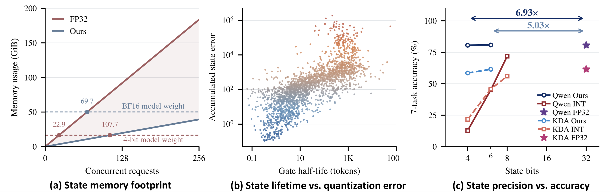
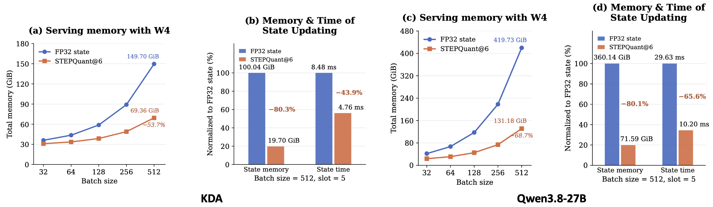

# STEPQuant: When and Where Errors Matter in Delta-Rule Recurrent State Quantization

<p align="center">
  <a href="https://arxiv.org/abs/2609.38169"></a>
  <a href="https://github.com/Dreamer-Toby/STEPQuant"></a>
  <a href="REPRODUCTION.md"></a>
</p>

Welcome to the official code repository for **[STEPQuant: When and Where Errors Matter in Delta-Rule Recurrent State Quantization](https://arxiv.org/abs/2609.38169)**.

Your star means a lot to us in developing this project! ⭐⭐⭐

## 📰 News

- [2026/09/30] 📄 Our [paper](https://arxiv.org/abs/2609.38169) is available on arXiv.
- [2026/09/29] 🚀 STEPQuant code is available in this repository.

## 👀 Overview

**STEPQuant** compresses the persistent recurrent states of Delta-rule models. It decides **when** errors will last and **where** they will affect the output, then spends precision accordingly.

<p align="center">
  <a href="imgs/fig1.png"></a>
</p>

Fixed-size state per request still means growing memory under concurrency. Uniform low-bit quantization also feeds its errors into every subsequent state update.

## 🧩 Method

- **When — lifetime-aware bit allocation:** Give more bits to state units with larger, longer-lived errors; protect a few high-risk units in FP16.
- **Where — key-row-aware dual-axis fitting:** Scale key rows and value columns separately, prioritizing rows that matter most to the readout.

Allocation is calibrated once; packed-state kernels and asynchronous writeback keep inference efficient.

## 📊 Results

**Seven long-generation tasks · BF16 weights with quantized states · Average acc (%)**

| Model | FP32 | INT8 | INT6 | STEPQuant@6 | STEPQuant@4 |
| :-- | --: | --: | --: | --: | --: |
| Qwen3.8-27B | 80.60 | 71.86 | 45.04 | **80.59** | **80.51** |
| Kimi-Linear-48B-A3B-Instruct | 61.52 | 56.02 | 45.70 | **61.47** | **58.52** |

<p align="center">
  <a href="imgs/fig3.png"></a>
</p>

In the paper's serving memory accounting, **STEPQuant@6** compresses recurrent-state memory by **5.03× / 5.08×** and reduces total memory by **68.7% / 53.7%** on Qwen / Kimi, respectively.

<sub>Paper-reported results. Memory accounting uses W4/AWQ weights and five prefix-state slots per request (Figure 3(c)). Full-model decode throughput uses BF16 weights, batches 32–512, and 128 prompt + 1024 decode tokens (Appendix F.5). Task evaluations use NVIDIA A800 GPUs. The 4/6-bit budgets are nominal; FP16 pivots and scales add storage.</sub>

## ⚙️ Quick Start

Run from the repository root. The tested stack uses **SGLang 0.5.12**, **PyTorch 2.11.0**, and **Triton 3.7.1**. You need model checkpoints, a CUDA toolkit, and four GPUs for this Qwen example.

**1. Reuse environments and set `model_path` in [`configs/models.json`](configs/models.json).**

```bash
bash scripts/reuse_sglang_env.sh /path/to/sglang-env
bash scripts/reuse_eval_env.sh .venv-serving
bash scripts/reuse_calibration_env.sh /path/to/qwen-env qwen
```

If the serving helper prints an `export CUDA_HOME=...` command, run it.

**2. Calibrate once, then serve.**

```bash
.venv-eval/bin/python -m stepquant.reproduction \
  --models qwen --formats stepquant6 --devices 0,1,2,3

CUDA_VISIBLE_DEVICES=0,1,2,3 .venv-serving/bin/python -m stepquant.sglang \
  --model-path /path/to/Qwen3.8-27B --tp-size 4 \
  --state-format stepquant6 --plan artifacts/reproduction/plans/qwen-stepquant6.pt \
  --attention-backend triton --reasoning-parser qwen3 \
  --context-length 131072 --chunked-prefill-size 2048 \
  --mem-fraction-static 0.85 --served-model-name stepquant \
  --host 127.0.0.1 --port 31080
```

**3. Evaluate.** Stop the manually launched server first; the evaluation suite starts its own.

```bash
.venv-eval/bin/python -m stepquant.evaluation.suite \
  --models qwen --benchmarks long --formats fp32 stepquant6 \
  --server-python .venv-serving/bin/python --devices 0,1,2,3 --tp 4
```

For Kimi setup, the zero-shot short-task protocol (2048 output tokens, thinking disabled), and paired FP32 decode benchmarks, see the [usage guide](REPRODUCTION.md).


## 📂 Contact
If you have further questions, please open an issue or contact yaobingchen0515@gmail.com or xuhb2001@gmail.com.

Discussions and potential collaborations are also welcome.

## 🧠 Related Work

More of our work on model quantization:

- [**DuQuant++**: Fine-grained Rotation Enhances Microscaling FP4 Quantization](https://arxiv.org/abs/2604.17789)
- [**DuQuant**: Distributing Outliers via Dual Transformation Makes Stronger Quantized LLMs](https://arxiv.org/abs/2406.01721)
- [**QDLM**: Quantization Meets dLLMs: A Systematic Study of Post-training Quantization for Diffusion LLMs](https://arxiv.org/abs/2508.14896)
- [**QuantVLA**: QuantVLA: Scale-Calibrated Post-Training Quantization for Vision-Language-Action Models](https://arxiv.org/abs/2602.20309)
- [**LRQ-DiT**: LRQ-DiT: Log-Rotation Post-Training Quantization of Diffusion Transformers for Image and Video Generation](https://arxiv.org/abs/2508.03485)
- [**IntactKV**: Improving Large Language Model Quantization by Keeping Pivot Tokens Intact](https://arxiv.org/abs/2403.01241)
